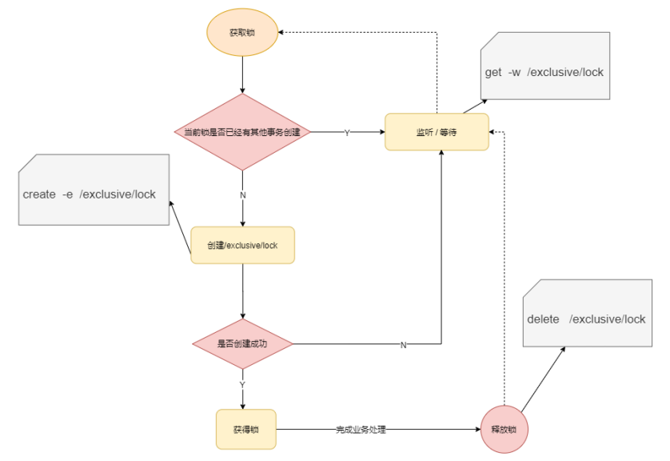
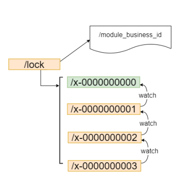
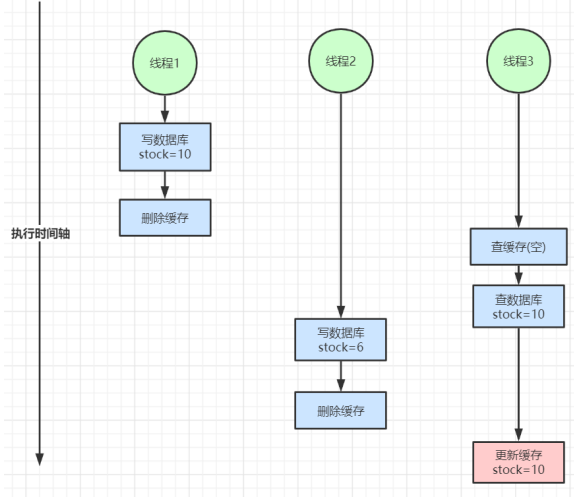
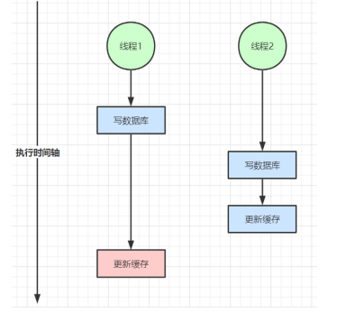
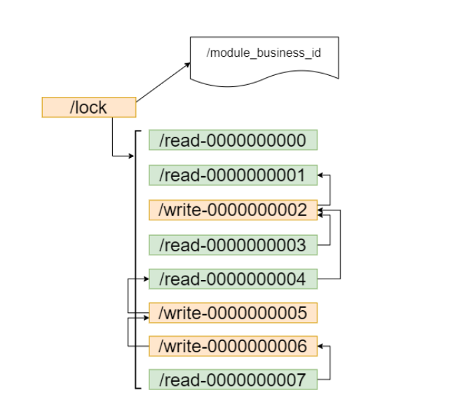
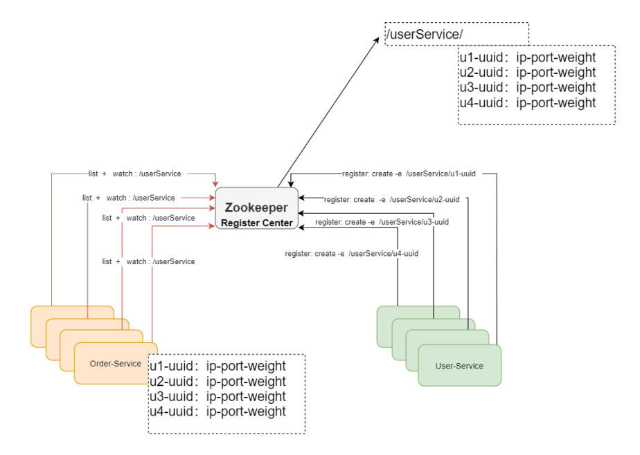

# Zookeeper

## 什么是zookeeper

> 基于内存的数据库，文件系统数据结构+监听通知机制

###### 文件系统数据结构-六种目录节点

1. Persistent 持久化目录节点
2. Persistent_sequential 持久化顺序编号目录节点
3. Ephemeral 临时目录节点
4. Ephemeral_sequntial 临时顺序编号目录节点
5. Container 如果底下没有子节点就会被自动清除
6. TLL 过了过期时间删除

###### 监听机制

1. 如果注册得是对某个节点的监听，则当这个节点被删除，或者被修改时对应的客户端将被通知
2. 如果注册的是对某个目录的监听，则当这个目录有子节点被创建，或者有子节点被删除，对应的客户端将被通知
3. 如果注册的是某个目录的递归子节点，则当这个目录下面的任意子节点有目录结构的变化或者根节点有数据变化，对应的客户端将被通知。

###### 应用场景

1. 分布式配置中心
2. 分布式注册中心
3. 分布式锁
4. 分布式队列
5. 集群选举
6. 分布式屏障
7. 发布\订阅

## Zookeeper的ACL权限控制

###### 授权id

###### 权限等级

1. c
2. r
3. w
4. d
5. a

## 内存数据和持久化

1. 事务日志
2. 快照文件

> 有了事务日志，为啥还要快照数据。 快照数据主要时为了快速恢复， 事务日志文件是每次事务请求都会进行追加的操作，而快照是达到某种设定条件下的内存全量数据。所以通常快照数据是反应当时内存数据的状态。事务日志是更全面的数据，所以恢复数据的时候，可以先恢复快照数据，再通过增量恢复事务日志中的数据即可。

## Springboot整合

> github地址：https://github.com/Wthah/springcloud_learn.git

###### 客户端创建

```java
package com.zane.util;

import lombok.extern.slf4j.Slf4j;
import org.apache.zookeeper.*;
import org.apache.zookeeper.data.Stat;
import org.junit.Before;
import org.junit.Test;

import java.io.IOException;
import java.util.concurrent.CountDownLatch;
import java.util.concurrent.TimeUnit;

@Slf4j
public class ZookeeperClientTest {

    private static final String ZK_ADDRESS="127.0.0.1:2181";

    private static final int SESSION_TIMEOUT = 5000;

    private static ZooKeeper zooKeeper;

    private static final String ZK_NODE="/zk-node/test";

    private static final String ZK_NODE_ASYNC = "/zk-node-async";

    @Before
    public void init() throws IOException, InterruptedException {
        final CountDownLatch countDownLatch = new CountDownLatch(1);
        zooKeeper = new ZooKeeper(ZK_ADDRESS,SESSION_TIMEOUT,watchedEvent -> {
           if(watchedEvent.getState() == Watcher.Event.KeeperState.SyncConnected&&watchedEvent.getType()==Watcher.Event.EventType.None) {
               countDownLatch.countDown();
               log.info("连接成功");
           }
        });
        log.info("连接中");
        countDownLatch.await();
    }

    //同步创建节点
    @Test
    public void createNode() throws KeeperException, InterruptedException {
        //参数说明
        //第一个参数是path路劲
        //第二个参数是data
        //第三个参数是acl权限
        //第四个参数是节点类型
        String path = zooKeeper.create(ZK_NODE, "data".getBytes(), ZooDefs.Ids.OPEN_ACL_UNSAFE, CreateMode.PERSISTENT);
        log.debug("create path:{}",path);
    }

    //异步创建节点
    @Test
    public void createNodeAsync() throws InterruptedException {
        /**
         * 参数说明
         * 第一个是path路径
         * 第二个是data
         * 第三个是acl权限
         * 第四个是节点类型
         * 第五个是回调接口 rc: 响应码， path：节点路径， ctx：上下文， name: 节点名称
         */
        zooKeeper.create(ZK_NODE_ASYNC, "data".getBytes(), ZooDefs.Ids.OPEN_ACL_UNSAFE, CreateMode.PERSISTENT, (rc,path,ctx,name)->{
            Thread thread = Thread.currentThread();
            log.debug("currentThread:{}, rc:{}, paht:{}, ctx:{}, name:{}",thread.getName(),rc,path,ctx,name);
        },"centext");
        TimeUnit.SECONDS.sleep(Integer.MAX_VALUE);
    }

    @Test
    public void updateNode() throws KeeperException, InterruptedException {
        Stat stat = new Stat();
        byte[] data = zooKeeper.getData(ZK_NODE, false, stat);
        log.debug("修改前：{}", new String(data));
        //通过version实现乐观锁 期间有其他线程也修改了数据则更新不成功
        zooKeeper.setData(ZK_NODE, "changeed".getBytes(), stat.getVersion());
        byte[] dataAfter = zooKeeper.getData(ZK_NODE, false, stat);
        log.debug("修改后：{}", new String(dataAfter));
    }
}
```

###### Curator

> 对Zookeeper进行封装。在重新连接、Watch反复注册、多种异常处理等情况，原生的Zookeeper处理复杂，使用Curator减少开发事件


```java
package com.zane.util;

import lombok.extern.slf4j.Slf4j;
import org.apache.curator.RetryPolicy;
import org.apache.curator.framework.CuratorFramework;
import org.apache.curator.framework.CuratorFrameworkFactory;
import org.apache.curator.framework.state.ConnectionState;
import org.apache.curator.retry.ExponentialBackoffRetry;
import org.apache.zookeeper.CreateMode;
import org.junit.After;
import org.junit.Before;
import org.junit.Test;

import java.util.concurrent.Executor;
import java.util.concurrent.ExecutorService;
import java.util.concurrent.Executors;
import java.util.concurrent.TimeUnit;

@Slf4j
public class ZookeeperCuratorTest {

    private static final String CONNECT_STR = "127.0.0.1:2181";
    private static final int sessionTimeoutMs = 60*1000;
    private static final int connectionTimeoutMs = 5000;
    private static CuratorFramework curatorFramework;

    @Before
    public void init() {
        RetryPolicy retryPolicy = new ExponentialBackoffRetry(5000, 30);
        curatorFramework = CuratorFrameworkFactory.builder().connectString(CONNECT_STR)
                .retryPolicy(retryPolicy)
                .sessionTimeoutMs(sessionTimeoutMs)
                .connectionTimeoutMs(connectionTimeoutMs)
                .canBeReadOnly(true)
                .build();
        curatorFramework.getConnectionStateListenable().addListener((client, newState) -> {
            if(newState == ConnectionState.CONNECTED) {
                log.info("连接成功！");
            }
        });
        log.info("连接中......");
        curatorFramework.start();
    }

    public static CuratorFramework getCuratorFramework() {
        return curatorFramework;
    }

//    @After
//    public void test(){
//        try {
//            TimeUnit.SECONDS.sleep(Integer.MAX_VALUE);
//        } catch (InterruptedException e) {
//            e.printStackTrace();
//        }
//    }

    @Test
    public void createMode() throws Exception {
        curatorFramework.create().withMode(CreateMode.PERSISTENT).forPath("/curator-node","some-data".getBytes());
        log.debug("curator create node :{} successfully.","curator-node");
    }

    @Test
    public void craeteNodeWithParent() throws Exception {
        String pathWithParent="/node-parent/sub-node-1";
        String path = curatorFramework.create().creatingParentsIfNeeded().forPath(pathWithParent);
        log.debug("curator create node :{} successfully.", path);
    }

    @Test
    public void getNodeData() throws Exception {
        byte[] bytes = curatorFramework.getData().forPath("/curator-node");
        log.debug("get data from node :{} successfully", new String(bytes));
    }

    @Test
    public void updateNode() throws Exception {
        curatorFramework.setData().forPath("/curator-node","changed".getBytes());
        byte[] bytes = curatorFramework.getData().forPath("/curator-node");
        log.debug("get data from node /curator-node :{} successfully", new String(bytes));
    }

    @Test
    public void deleteNode() throws Exception {
        String pathWithParent = "/node-parent";
        curatorFramework.delete().guaranteed().deletingChildrenIfNeeded().forPath(pathWithParent);
    }

    //异步获取信息
    @Test
    public void getDataAsync() throws Exception {
        curatorFramework.getData().inBackground((item1, item2) -> {
            log.debug("background: {}", new String(item2.getData()));
        }).forPath("/curator-node");

        log.debug("do other thinds");
    }

    //异步指定线程池
    @Test
    public void getDataWithPool() throws Exception {
        ExecutorService executorService = Executors.newSingleThreadExecutor();
        curatorFramework.getData().inBackground((item1, item2) -> {
            log.debug("background :{}",new String(item2.getData()));
        },executorService).forPath("/curator-node");

        log.debug("do other thing");
    }
}

```

###### Curator 监听

```java
//节点监听
    @Test
    public void testNodeCacheTest() throws Exception {
        NodeCache nodeCache = new NodeCache(curatorFramework, "/curator-node");
        nodeCache.getListenable().addListener(new NodeCacheListener() {
            @Override
            public void nodeChanged() throws Exception {
                log.debug("{} path node changed!", "/curator-node");
            }
        });
        nodeCache.start();
    }

    public void printNodeData() throws Exception {
        byte[] bytes = curatorFramework.getData().forPath("/curator-node");
        log.debug("data: {}",new String(bytes));
    }

    //子节点监听
    public void testPathCache() throws Exception {
        PathChildrenCache pathChildrenCache = new PathChildrenCache(curatorFramework, "/curator-node", true);
        pathChildrenCache.getListenable().addListener(new PathChildrenCacheListener() {
            @Override
            public void childEvent(CuratorFramework curatorFramework, PathChildrenCacheEvent pathChildrenCacheEvent) throws Exception {
                log.debug("event: {}", pathChildrenCacheEvent);
            }
        });

        pathChildrenCache.start();
    }

    //路径下所有子节点
    @Test
    public void testTreeCache() throws Exception {

        TreeCache treeCache = new TreeCache(curatorFramework, "/curator-node");
        treeCache.getListenable().addListener(new TreeCacheListener(){
            @Override
            public void childEvent(CuratorFramework curatorFramework, TreeCacheEvent treeCacheEvent) throws Exception {
                log.info(" tree cache: {}",treeCacheEvent);
            }
        });

        treeCache.start();

    }
```


## 集群模式

###### 三种类型角色

- Leader 处理所有的事务请求（写请求）
- Follower 只能处理读请求，作为Leader的候选节点
- Observer 只能处理读请求

## 应用场景

###### 加锁

- 非公平锁

  

  *如上实现方式在并发问题比较严重的情况下，性能会下降的比较厉害，主要原因是，所有的连接都在对同一个节点进行监听，当服务器检测到删除事件时，要通知所有的连接，所有的连接同时收到事件，再次并发竞争，这就是羊群效应。这种加锁方式是非公平锁的具体实现。*

- 公平锁

  

  *1.请求进来,直接在/lock节点下创建一个临时顺序节点 2.判断自己是否在/lock节点下最小的节点 a.如果是最小的节点,获得锁 b.如果不是,监听前一个节点*

- 分布式锁-共享锁

  > 前面这两种加锁方式有一个共同的特质，就是都是互斥锁，同一时间只能有一个请求占用，如果是大量的并发上来，性能是会急剧下降的，所有的请求都得加锁，那是不是真的所有的请求都需要加锁呢？答案是否定的，比如如果数据没有进行任何修改的话，是不需要加锁的，但是如果读数据的请求还没读完，这个时候来了一个写请求，怎么办呢？有人已经在读数据了，这个时候是不能写数据的，不然数据就不正确了。直到前面读锁全部释放掉以后，写请求才能执行，所以需要给这个读请求加一个标识（读锁），让写请求知道，这个时候是不能修改数据的。不然数据就 不一致了。如果已经有人在写数据了，再来一个请求写数据，也是不允许的，这样也会导致数据的不一致，所以所有的写请求，都需要加一个写锁，是为了避免同时对共享数据进行写操作。

  1. 读写不一致

     

  2. 双写不一致

     
     
  3. Zookeeper提供的共享锁原理
  
     
  
     *1.read请求,如果前边的节点都是读锁,直接获取锁,如果read请求前面有写请求,则该读请求阻塞等待获取锁,需要对前面的最近的写节点进行监听。*
  
     *2.write请求,只需要对前面的节点进行监听，和非公平锁的原理一样*

###### Leader选举

> 非Zookeeper本身的选举，而是用于选举类似于像缓存预热服务器

###### 注册中心

> *就是让众多的服务，都在Zookeeper中进行注册，啥是注册，注册就是把自己的一些服务信 息，比如IP，端口，还有一些更加具体的服务信息，都写到 Zookeeper节点上， 这样有需要的服务就可以直接从zookeeper上面去拿，怎么拿呢？ 这时我们可以定义统一的名称，比如， User-Service, 那所有的用户服务在启动的时候，都在User-Service 这个节点下面创建一个子节点（临时节点），这个子节点保持唯一就好，代表了每个服务实例的唯一标识，有依赖用户服务 的比如Order-Service 就可以通过User-Service 这个父节点，就能获取所有的User-Service 子 节点，并且获取所有的子节点信息（IP，端口等信息），拿到子节点的数据后Order-Service可 以对其进行缓存，然后实现一个客户端的负载均衡，同时还可以对这个User-Service 目录进行 监听， 这样有新的节点加入，或者退出，Order-Service都能收到通知，这样Order-Service重 新获取所有子节点，且进行数据更新。这个用户服务的子节点的类型为临时节点。Zookeeper中临时节点生命周期是和SESSION绑定的，如果SESSION超时了，对应的节点会被删除，被删除时，Zookeeper 会通知对该节点父节点进行监听的客户端, 这样对应的客户端又可以刷新本地缓存了。当有新服务加入时，同样也会通知对应的客户端，刷新本地缓存，要达到这个目标需要客户端重复的注册对父节点的监听。这样就实现了服务的自动注册和自动退出.*
>
> github地址：https://github.com/Wthah/springcloud_learn.git



