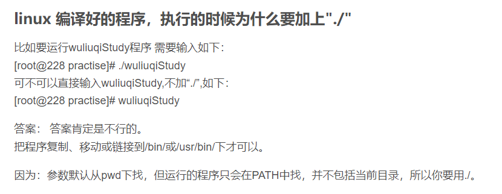
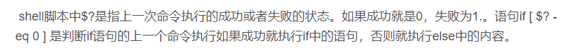

# 工作经验小笔记

## 2022/5/25

###### linux定位文件位置

- whereis

  > 但是该数据库文件并不是实时更新，默认情况下时一星期更新一次，因此，我们在用whereis和locate 查找文件时，有时会找到已经被删除的数据，或者刚刚建立文件，却无法查找到，原因就是因为数据库文件没有被更新。 

- find

  > https://blog.csdn.net/l_liangkk/article/details/81294260?ops_request_misc=%257B%2522request%255Fid%2522%253A%2522165344251116782350987435%2522%252C%2522scm%2522%253A%252220140713.130102334..%2522%257D&request_id=165344251116782350987435&biz_id=0&utm_medium=distribute.pc_search_result.none-task-blog-2~all~top_positive~default-1-81294260-null-null.142^v10^pc_search_result_control_group,157^v12^control&utm_term=find%E5%91%BD%E4%BB%A4&spm=1018.2226.3001.4187
  
- which

  > which命令的作用是，在PATH变量指定的路径中，搜索某个系统命令的位置，并且返回第一个搜索结果。
  >
  > 也就是说，使用which命令，就可以看到某个系统命令是否存在，以及执行的到底是哪一个位置的命令。 
  >
  > 命令行输入export可以查看PATH变量

- locate

  > yum -y install mlocate
  >
  > https://blog.csdn.net/yspg_217/article/details/122113017?ops_request_misc=%257B%2522request%255Fid%2522%253A%2522165345743216782425186259%2522%252C%2522scm%2522%253A%252220140713.130102334..%2522%257D&request_id=165345743216782425186259&biz_id=0&utm_medium=distribute.pc_search_result.none-task-blog-2~all~sobaiduend~default-1-122113017-null-null.142^v10^pc_search_result_control_group,157^v12^control&utm_term=linux+locate&spm=1018.2226.3001.4187

###### ./



###### sh和bash

> sh 遵循POSIX规范：“当某行代码出错时，不继续往下解释”。bash 就算出错，也会继续向下执行。

```shell
#! /bin/bash --posix
#! /bin/sh
```

###### chmod

> https://blog.csdn.net/u013197629/article/details/73608613?ops_request_misc=%257B%2522request%255Fid%2522%253A%2522165345862016782184644073%2522%252C%2522scm%2522%253A%252220140713.130102334..%2522%257D&request_id=165345862016782184644073&biz_id=0&utm_medium=distribute.pc_search_result.none-task-blog-2~all~top_positive~default-1-73608613-null-null.142^v10^pc_search_result_control_group,157^v12^control&utm_term=linux%E6%9D%83%E9%99%90&spm=1018.2226.3001.4187

###### xargs

```shell
Administrator@51B6904C3C8A485 ~/test
$ ls

Administrator@51B6904C3C8A485 ~/test
$ touch a.txt b.txt c.log

Administrator@51B6904C3C8A485 ~/test
$ mkdir d; cd d

Administrator@51B6904C3C8A485 ~/test/d
$ touch e.txt

Administrator@51B6904C3C8A485 ~/test/d
$ cd ..

Administrator@51B6904C3C8A485 ~/test
$ find -name "*.txt" | xargs rm -rf

Administrator@51B6904C3C8A485 ~/test
$ ls
c.log  d

Administrator@51B6904C3C8A485 ~/test
$ ls d/

Administrator@51B6904C3C8A485 ~/test
$
```

## $?



## [[]]

> https://blog.csdn.net/anqixiang/article/details/111598067?ops_request_misc=%257B%2522request%255Fid%2522%253A%2522165355092816780357258308%2522%252C%2522scm%2522%253A%252220140713.130102334..%2522%257D&request_id=165355092816780357258308&biz_id=0&utm_medium=distribute.pc_search_result.none-task-blog-2~all~sobaiduend~default-1-111598067-null-null.142^v10^pc_search_result_control_group,157^v12^control&utm_term=%5B%5B+%5D%5D&spm=1018.2226.3001.4187
