# Selenium

## 1. 使用步骤

### Selenium IDE 安装及使用

> 可以不用写脚本，用来录制测试人员在网页的操作，然后保存操作，最后重新测试的时候可以重新执行测试。

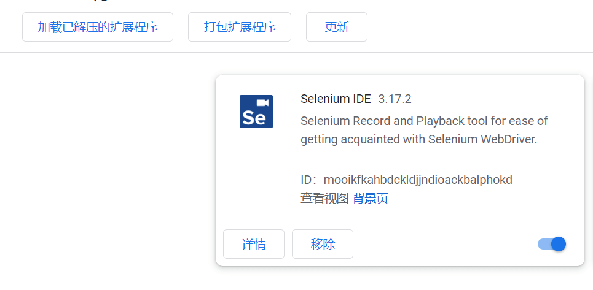

> 1. 录制
>
>    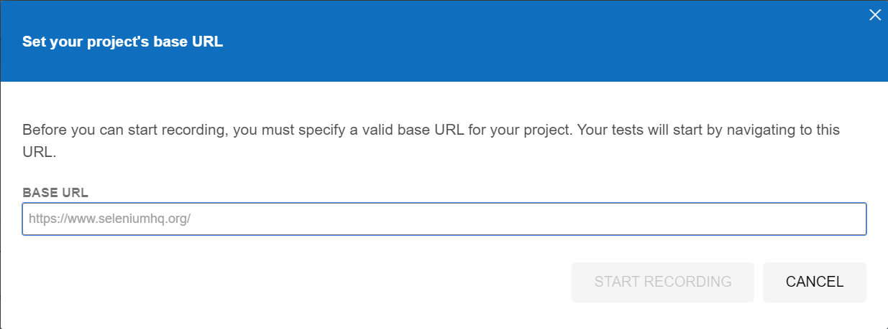
>
>    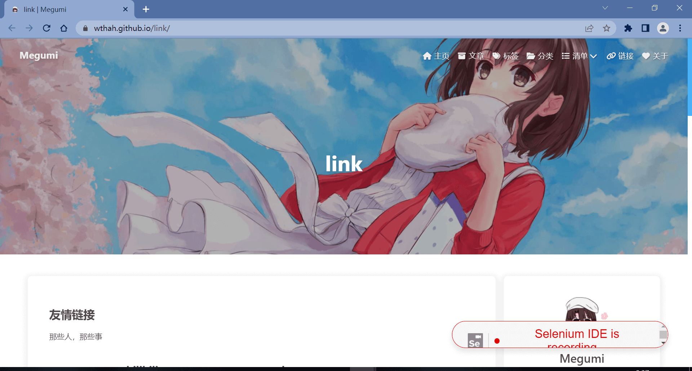
>
>    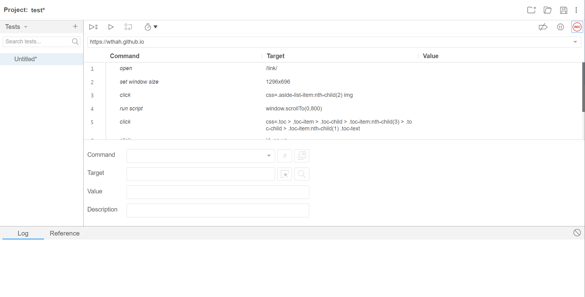
>
> 2. 执行
>
>    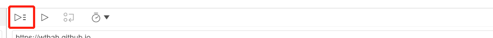
>
> 3. 保存

### Selenium WebServer安装及使用

###### maven

```maven
<dependency>
        <groupId>org.seleniumhq.selenium</groupId>
        <artifactId>selenium-java</artifactId>
        <version>3.141.59</version>
</dependency>
```

###### 元素操作

> 1. clear（）
> 2. click（）
> 3. sendKeys（）

```java

// 连接火狐
public static void openFirefox(){
    // 设置火狐浏览器exe位置
    System.setProperty("webdriver.firefox.bin","D:\\soft\\FireFox\\firefox.exe");
    // 下载火狐浏览器驱动geckodriver保证火狐能够看得懂我们的代码
    System.setProperty("webdriver.gecko.driver","src/main/resources/geckodriver.exe");
    FirefoxDriver firefoxDriver = new FirefoxDriver();
    firefoxDriver.get("https://wthah.github.io/link/");
}
// 连接谷歌
public static void openChrome(){
    // 下载谷歌驱动
    System.setProperty("webdriver.chrome.driver","src/main/resources/chromedriver.exe");
    // 1. 打开浏览器
    ChromeDriver chromeDriver = new ChromeDriver();
    // 2. 访问网站
    chromeDriver.get("https://wthah.github.io/link/");
}

public static void main(String[] args) throws InterruptedException {
        openChrome();
    	// 填写输入框
        chromeDriver.findElement(By.id("kw")).sendKeys("1234");
        // 强制睡眠3s
        Thread.sleep(3000);
    	// 清空输入框
        chromeDriver.findElement(By.id("kw")).clear();
    	// 定位kw输入框
        WebElement webElement = chromeDriver.findElement(By.id("kw"));
        // getTagName
        System.out.println(webElement.getTagName());
        // getAttribute
        System.out.println(webElement.getAttribute("maxlength"));
        // getText
        System.out.println(webElement.getText());
        // isDisplayed
        System.out.println(webElement.getText());
}
```

###### 元素定位

```java
public static void main(String[] args) {
        openChrome();
        chromeDriver.findElement(By.id("kw")).sendKeys("Megumi");
        chromeDriver.findElement(By.id("su")).click();
        // 定位name
        // 定位tagname
        // 定位classname
        // 定位LinkText
        chromeDriver.findElement(By.linkText("新闻")).click();
        // 定位patialLinkText
        chromeDriver.findElement(By.partialLinkText("新")).click();
        // css元素定位（略写）
        // xpath元素定位 
}
```

> `快速获取xpath和css方法：` 
>
> 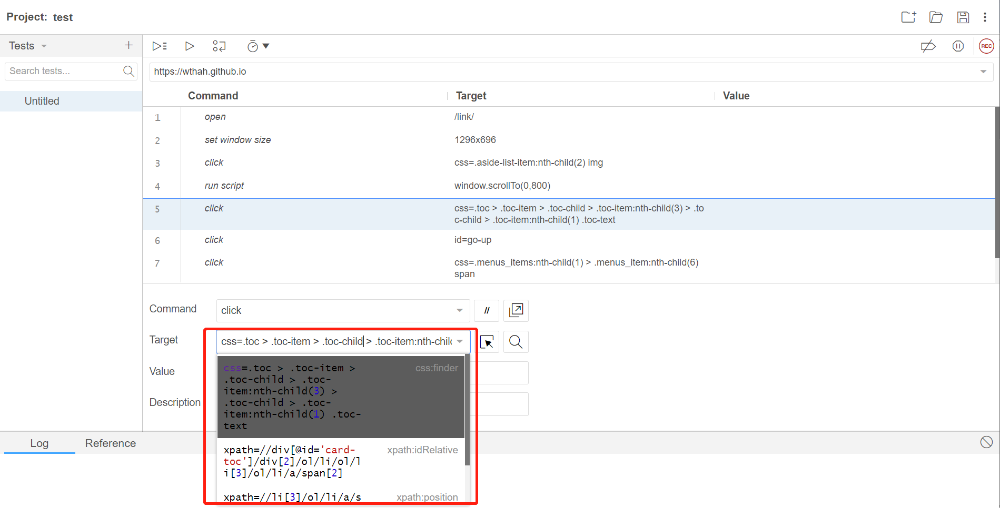
>
> 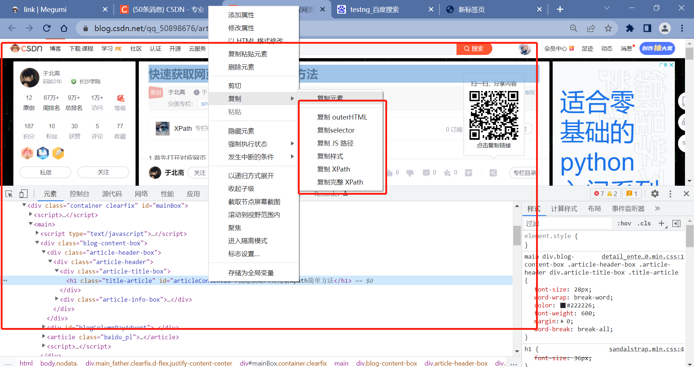
>
> 
>
> `xpath手写：`https://blog.csdn.net/weixin_49981930/article/details/123093827?ops_request_misc=%257B%2522request%255Fid%2522%253A%2522165326893816780357228898%2522%252C%2522scm%2522%253A%252220140713.130102334..%2522%257D&request_id=165326893816780357228898&biz_id=0&utm_medium=distribute.pc_search_result.none-task-blog-2~all~sobaiduend~default-2-123093827-null-null.142^v10^pc_search_result_control_group,157^v4^control&utm_term=selenium+xpath%E5%AE%9A%E4%BD%8D&spm=1018.2226.3001.4187 

###### driver操作

```java
public static void main(String[] args) throws InterruptedException {
        openChrome();
    
    	// url，title，退出页面
        System.out.println(chromeDriver.getCurrentUrl());
        System.out.println(chromeDriver.getTitle());
        System.out.println(chromeDriver.getPageSource());
        chromeDriver.quit();
        chromeDriver.close();
    
    	// 句柄获得
        chromeDriver.findElement(By.id("kw")).sendKeys("腾讯课堂");
        chromeDriver.findElement(By.id("su")).click();
        System.out.println("打开前的句柄"+chromeDriver.getWindowHandle());
        Thread.sleep(1000);
        chromeDriver.findElement(By.linkText("官方")).click();
        System.out.println("打开后的句柄"+chromeDriver.getWindowHandle());

        // options菜单操作对象（屏幕大小控制）
        WebDriver.Options options = chromeDriver.manage();
        options.window().fullscreen();
        Dimension dimension = options.window().getSize();
        System.out.println(dimension.getHeight());
        System.out.println(dimension.getWidth());
        System.out.println(options.window().getPosition().getX());
        System.out.println(options.window().getPosition().getY());

        // navigate（前进后退）
        WebDriver.Navigation navigation = chromeDriver.navigate();
        Thread.sleep(1000);
        navigation.to("https://Wthah.github.io");
        Thread.sleep(1000);
        navigation.refresh();
        Thread.sleep(1000);
        navigation.back();
        Thread.sleep(1000);
        navigation.forward();
}
```

###### 三种等待方式

```java
public static void main(String[] args) throws InterruptedException {
        openChrome();
        // 隐式等待（所有操作都要等待固定时间）
        chromeDriver.manage().timeouts().implicitlyWait(5, TimeUnit.SECONDS);
        chromeDriver.get("https://baidu.com");
        chromeDriver.findElement(By.id("kw")).sendKeys("腾讯课堂");
        chromeDriver.findElement(By.id("su")).click();
        
        // 硬性等待（单个操作强制等待）
        Thread.sleep(30000);
        chromeDriver.findElement(By.xpath("//a[text() = '-综合性在线终身学习平台']")).click();

        //显示等待（等条件出现了在继续执行后续代码）
        WebDriverWait webDriverWait = new WebDriverWait(chromeDriver,5);
        webDriverWait.until(ExpectedConditions.visibilityOfElementLocated(By.xpath("//a[text() = '-综合性在线终身学习平台']")));

}
```

###### 特殊组件（并不完整）

```java
public static void main(String[] args) throws InterruptedException {
        openChrome();
        // alert
        // 找到alert
        Alert alert = chromeDriver.switchTo().alert();
        alert.accept();
        alert.dismiss();
        System.out.println(alert.getText());
        // confirm
        // 找到confirm
        chromeDriver.switchTo().alert();
        alert.accept();
        alert.dismiss();
        alert.getText();
        // iframe
        // 在默认页面输入数据
        chromeDriver.findElement(By.id("aa")).sendKeys("aa");;
        chromeDriver.switchTo().frame("bframe");
        chromeDriver.findElement(By.id("bb")).sendKeys("bb");
        chromeDriver.switchTo().defaultContent();
        //window切换
        chromeDriver.findElement(By.id("aa")).sendKeys("a");

        chromeDriver.findElement(By.id("b")).click();;
        // 句柄切换
        // 切换到b之后获取所有窗口的句柄
        Set<String> handles = chromeDriver.getWindowHandles();
        for(String handle: handles){
            chromeDriver.switchTo().window(handle);
            if(chromeDriver.getTitle().equals("***")){
                break;
            }
        }

        // select
        chromeDriver.findElement(By.className("setting-text")).click();
        chromeDriver.findElement(By.xpath("//a[text()='高级搜索']")).click();
        Thread.sleep(2000);
        WebElement webElement = chromeDriver.findElement(By.name("qpc"));
        Select select = new Select(webElement);

    }
```

### Testng生成log

###### 导入maven

```xml
<dependency>
    <groupId>org.testng</groupId>
    <artifactId>testng</artifactId>
    <version>6.14.3</version>
</dependency>

<dependency>
    <groupId>org.uncommons</groupId>
    <artifactId>reportng</artifactId>
    <version>1.1.4</version>
    <scope>test</scope>
</dependency>
<dependency>
    <groupId>com.google.inject</groupId>
    <artifactId>guice</artifactId>
    <version>4.0</version>
    <scope>test</scope>
</dependency>
```


###### 导入插件

```xml
<plugins>
    <plugin>
        <groupId>org.apache.maven.plugins</groupId>
        <artifactId>maven-surefire-plugin</artifactId>
        <version>2.17</version>
        <configuration>
            <suiteXmlFiles>
                <suiteXmlFile>xmlfile/testng.xml</suiteXmlFile>
            </suiteXmlFiles>
        </configuration>
    </plugin>
    <plugin>
        <groupId>org.apache.maven.plugins</groupId>
        <artifactId>maven-surefire-plugin</artifactId>
        <version>2.19.1</version>
        <configuration>
            <properties>
                <property>
                    <name>usedefaultlisteners</name>
                    <value>false</value>
                </property>
                <property>
                    <name>listener</name>
                    <value>org.uncommons.reportng.HTMLReporter, org.uncommons.reportng.JUnitXMLReporter</value>
                </property>
            </properties>
            <workingDirectory>target/</workingDirectory>
        </configuration>
    </plugin>
</plugins>
```

###### 编写test.xml

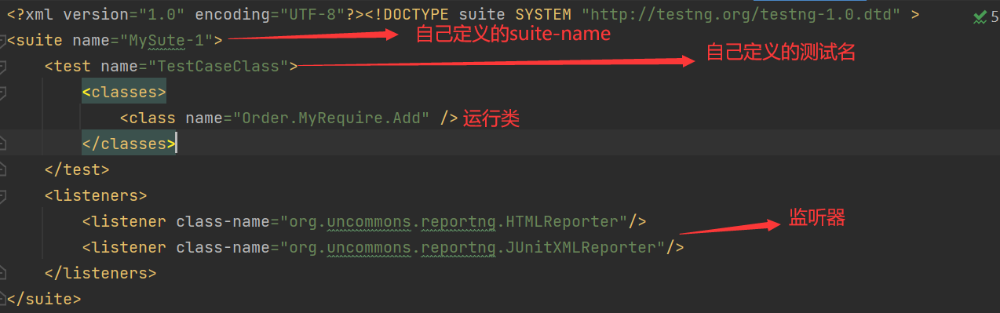

###### 添加日志

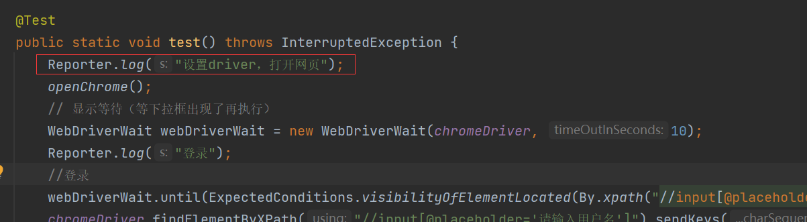

###### 运行xml，查看输出

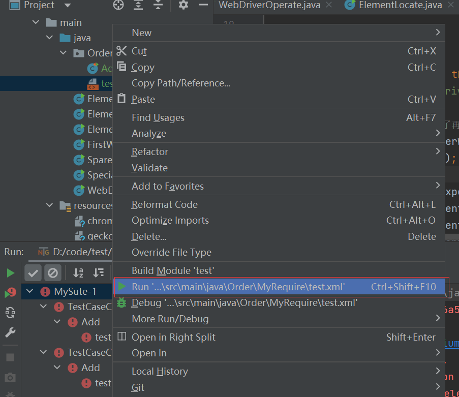

###### 输出一般在项目根目录下的test-output中的html文件里边

`index.html`

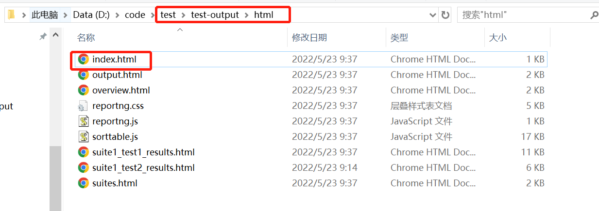

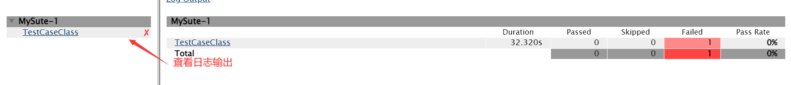

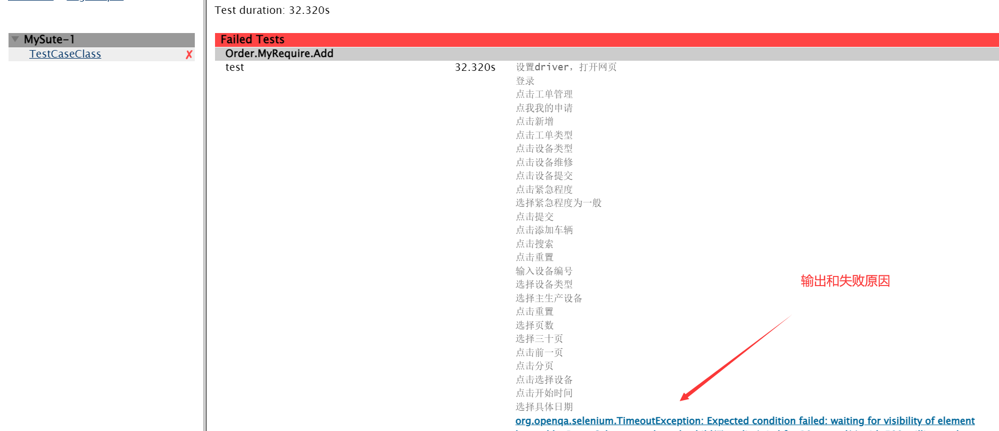

###### testng的使用

这篇包含`testng注释`和使用`全部测试和部分测试的xml`如何编写

> https://blog.csdn.net/weixin_39909877/article/details/108696188?ops_request_misc=%257B%2522request%255Fid%2522%253A%2522165327012316781483779829%2522%252C%2522scm%2522%253A%252220140713.130102334..%2522%257D&request_id=165327012316781483779829&biz_id=0&utm_medium=distribute.pc_search_result.none-task-blog-2~all~top_click~default-2-108696188-null-null.142^v10^pc_search_result_control_group,157^v4^control&utm_term=testng&spm=1018.2226.3001.4187
